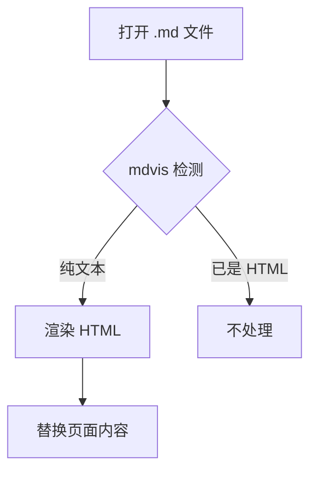
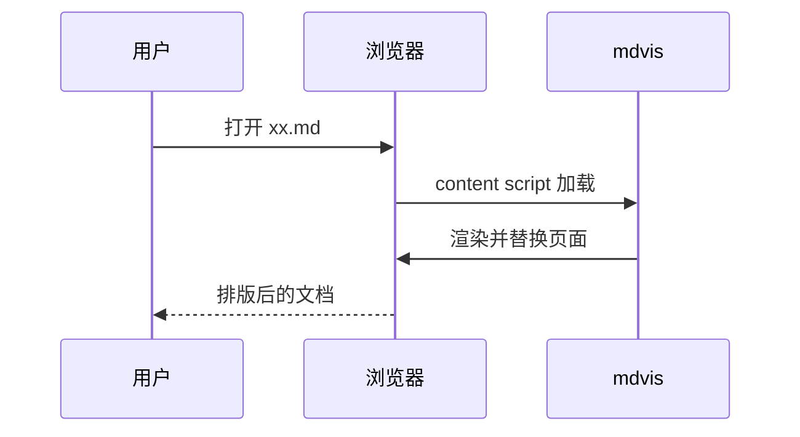

# mdvis 验证文档

这个文档用于验证 mdvis 插件的渲染效果 :smile: :rocket: :tada:

## 基础排版

支持**加粗**、*斜体*、`行内代码`、~~删除线~~，以及中英文混排 the quick brown fox 敏捷的棕色狐狸。

> 这是一段引用。排版应当清晰，字体统一为系统无衬线字体。

1. 有序列表项一
2. 有序列表项二
   - 嵌套无序项
   - 再一项

## 代码高亮

```python
def fib(n: int) -> int:
    """计算斐波那契数列"""
    if n < 2:
        return n
    return fib(n - 1) + fib(n - 2)
```

```js
const greet = (name) => {
  console.log(`hello, ${name}`);
};
```

## 表格

| 特性 | 状态 | 备注 |
| --- | --- | --- |
| emoji | ✅ | Unicode 输出 |
| mermaid | ✅ | SVG 渲染 |
| 代码高亮 | ✅ | highlight.js |

## Mermaid 流程图



## Mermaid 时序图



## 故意写错的 mermaid（应显示错误提示而不是整页崩溃）

```mermaid
graph TD
  A[ -->| 这是错误的语法
```

## 长文本换行测试

这是一段较长的中文文本，用来测试段落换行和行高是否舒适。Markdown 是一种轻量级标记语言，它允许人们使用易读易写的纯文本格式编写文档，然后转换成有效的 HTML 文档。This is a longer English paragraph to test line wrapping and line height. Markdown is a lightweight markup language that you can use to add formatting elements to plaintext text documents.
